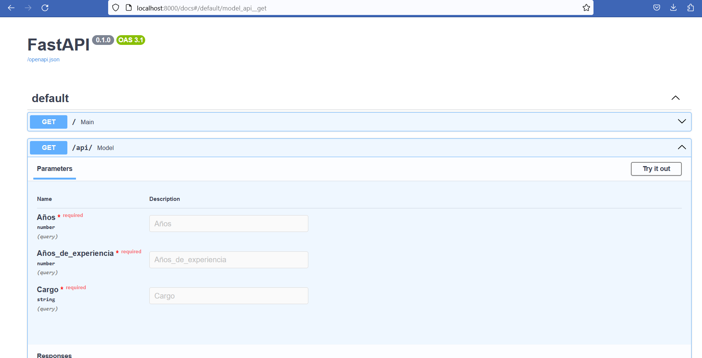

# Fast_API_ML

En este repositorio se encuentra un caso sencillo de como levantar un modelo de ML (regresión Lineal Multiple) en una API.En este
caso la API fue desarrollada con FAST API.

La API se puede ejecutar directamente desde la terminal,sin embargo se implemento la posibilidad de desplegarla en contenedores Docker.

Esta API permite calcular los sueldos en tecnologia en CLP,mediante un modelo de regresion lineal multiple.Sin embargo el modelo solo cuenta con 3 variables independientes.Finalmente los sueldos determinados solo son una referencia de acuerdo a una pequeña muestra,no reflejan necesariamente la realidad de los sueldos en Chile. 

En caso de mayor detalle los datos y el modelo se encuentran dentro de la carpeta train-model.

## Estructura

El siguiente proyecto considera como archivos y elementos principales,el archivo **Dockerfile**,el archivo **requirements.txt** y **main.py** que se encuentra dentro de la carpeta app.

``` docker
- 📁 FAST_API_ML
  - 📄 .gitignore
  - 📄 README.md
  - 📄 Dockerfile
  - 📄 requirements.txt
  - 🖼️ api_1.png
    - 📁 app
      - 📄 main.py
    - 📁 modelo_regresion
      - 📄 modelo.pkl
      - 📄 regression_model.ipynb
      - 📄 modelo.py
      - 💹 Renta.csv

      
```

### Dockerfile

``` docker
FROM python:3.8

COPY requirements.txt /tmp/
RUN pip install --requirement /tmp/requirements.txt

EXPOSE 8000

COPY ./app /app

CMD ["uvicorn", "app.main:app", "--host", "0.0.0.0", "--port", "8000"]


```

## Build

Si bien la api puede ser ejecutada directamente desde la terminal,en este caso creamos una imagen para luego ejecutarla en un contenedor.La ventaja de lanzarla en un contenedor,es que luego se podria desplegar en un servicio como Cloud Run de Google.

``` docker
docker build -t api_sueldos .
```

## Run

Una vez lista la imagen **api_sueldos**,ejecutamos la siguiente linea para ejecutar nuestra imagen dentro de un contenedor que tendra expuesto el puerto 8000.

``` docker
docker run -d -p 8000:8000 api_sueldos 
```
## Acceso al contenedor

Si todos los pasos anteriores se desarrollaron de forma correcta,deberiamos poder testear la api en la siguiente direccion

[127.0.0.1:8000/docs](http://127.0.0.1:8000/docs)

## API Sueldos

Esta es una api que permite determinar los sueldos en tecnologia de acuerdo a 3 variables de entrada.La primera variable es **Años**,que corresponde a la edad de la persona,la segunda variable es **Años de experiencia** que corresponde a los años de experiencia laboral y finalmente la variable **Cargo**,que en este momento solo tiene la opcion de 3 tipos de cargos:Data Engineer,Arquitecto de datos y Full- Stack.

