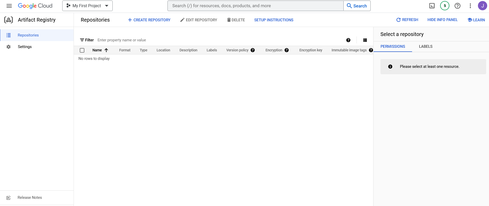
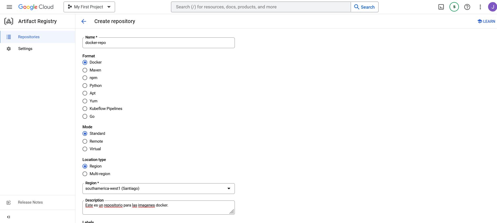
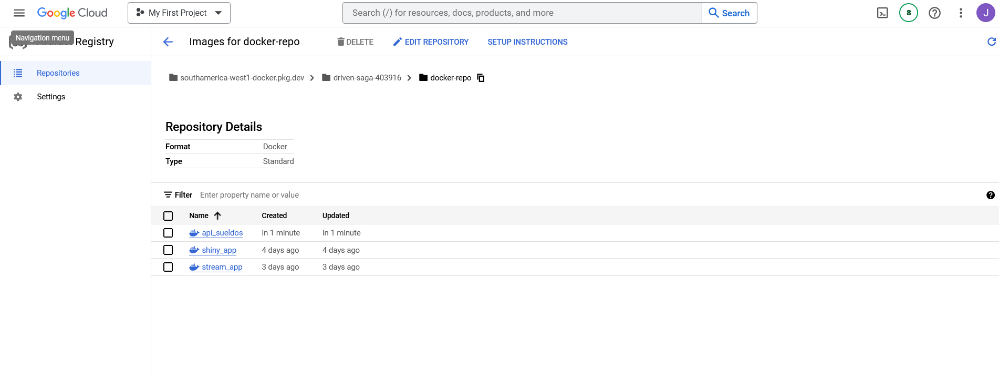
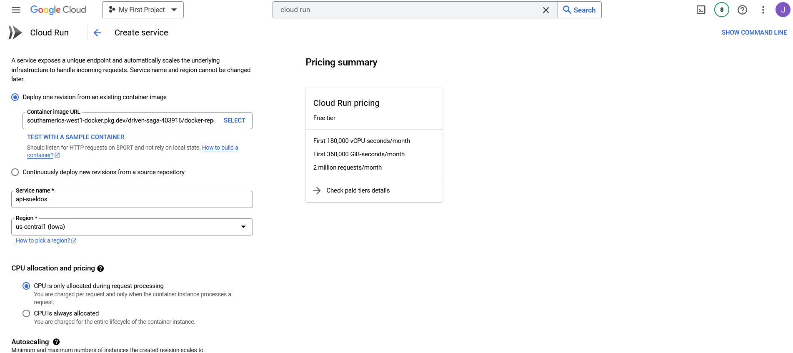
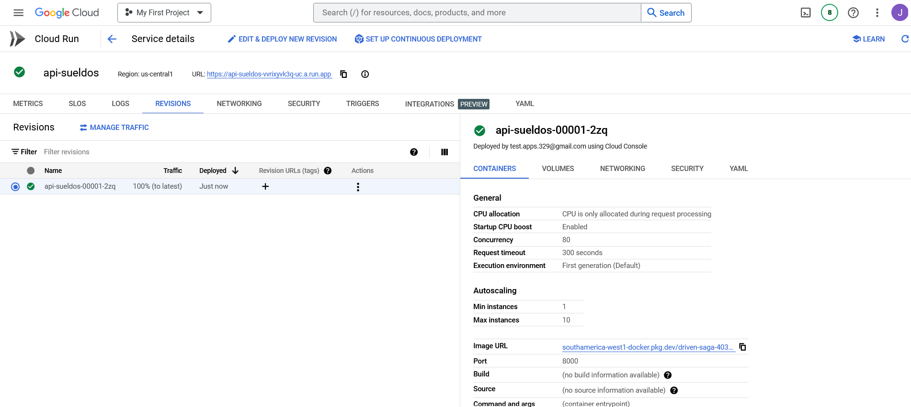
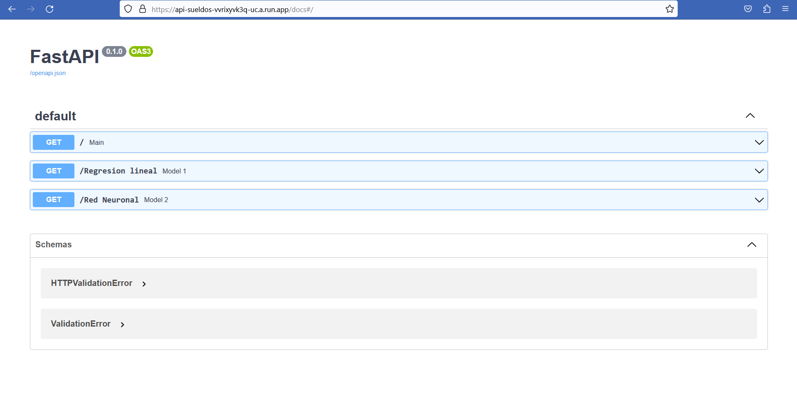

# Fast_API_ML

En este repositorio se encuentra una API con 2 endpoints,los cuales se pueden utilizar para determinar sueldos en tecnologia mediante 2 modelos de Machine Learning(Regresión Lineal Multiple y Red Neuronal).

La API se puede ejecutar directamente desde la terminal,sin embargo se implemento la posibilidad de desplegarla en el servicio Cloud Run mediante imagenes Docker.

Esta API permite calcular los sueldos en tecnologia en CLP mediante 2 formas distintas.El primer endpoint permite utilizar un modelo de regresion lineal multiple,el segundo endpoint lo realiza mediante una red neuronal.El modelo solo cuenta con 3 variables independientes.Finalmente los sueldos determinados solo son una referencia de acuerdo a una pequeña muestra,no reflejan necesariamente la realidad de los sueldos en Chile. 

En caso de mayor detalle los datos y el modelo se encuentran dentro de la carpeta modelo_regresion.

## Estructura

El siguiente proyecto considera como archivos y elementos principales,el archivo **Dockerfile**,el archivo **requirements.txt** y **main.py** que se encuentra dentro de la carpeta app.

``` docker
- 📁 FAST_API_ML
  - 📄 .gitignore
  - 📄 README.md
  - 📄 Dockerfile
  - 📄 requirements.txt
    - 📁 app
      - 📄 main.py
    - 📁 modelo_regresion
      - 📄 modelo_1.pkl
      - 📄 modelo_2.pkl
      - 📄 score_1.pkl
      - 📄 score_2.pkl
      - 📄 regression_model.ipynb
      - 📄 modelo.py
      - 💹 Renta.csv
  - 🖼️ api_1.png
  - 🖼️ artifact_registry.png
  - 🖼️ cloud_run_1.png
  - 🖼️ cloud_run_2.png
  - 🖼️ cloud_run_3.png
  - 🖼️ create_repo.png
  - 🖼️ image_repo_docker.png

      
```

### Dockerfile

``` docker
FROM python:3.8

COPY requirements.txt /tmp/
RUN pip install --requirement /tmp/requirements.txt

EXPOSE 8000

COPY ./app /app

CMD ["uvicorn", "app.main:app", "--host", "0.0.0.0", "--port", "8000"]


```

## Build

Con la siguiente linea construimos la imagen.

``` docker
docker build -t api_sueldos .
```

## Run

Una vez lista la imagen **api_sueldos**,ejecutamos la siguiente linea para testear la api de forma local en el puerto 8000.

``` docker
docker run -d -p 8000:8000 api_sueldos 
```
## Acceso al contenedor

Si todos los pasos anteriores se desarrollaron de forma correcta,deberiamos poder testear la api.

[127.0.0.1:8000/docs](http://127.0.0.1:8000/docs)

## Migrar imagen Docker

Para migrar la imagen,primero debemos habilitar el servicio Artifact Registry en Google Cloud Platform.Si lo habilitamos de forma correcta deberiamos ver la siguiente pantalla.



Luego en este servicio debemos crear un repositorio,el cual puede ser creado desde la consola de GCP o desde el menu **Create Repository**.



Cuando creamos el repositorio elegimos el format como Docker,el mode como standard y la region en este caso la fijare en southamerica-west1[Santiago].

Una vez creado el repositorio configuramos de forma local nuestro docker para poder hacer push o pull a las imagenes.

``` dockerfile
gcloud auth configure-docker southamerica-west1-docker.pkg.dev
```

Luego tenemos le tenemos que etiquetar nuestra API con la ruta del directorio del repositorio de imagenes en la nube.

``` dockerfile
docker tag api_sueldos:latest southamerica-west1-docker.pkg.dev/driven-saga-403916/docker-repo/api_sueldos:latest
```

Una vez etiquetada la imagen,le podemos dar a push a la imagen con la siguiente linea

``` dockerfile
docker push southamerica-west1-docker.pkg.dev/driven-saga-403916/docker-repo/api_sueldos:latest
```

Si la imagen fue cargada correctamente la podremos ver en el repositorio de Artifact Registry como se ve en la imagen.



Como podemos ver en la imagen,tenemos 3 imagenes.En este caso la que utilizaremos es la imagen **api_sueldos**,las otras 2 corresponden a otras apps que subi anteriormente.

## Desplegar con Cloud Run

Una vez accedemos al servicio Cloud Run,tenemos que crear un servicio en donde se abrira el siguiente menu.



Desde el menu de configuracion del servicio tenemos que seleccionar en la primera opcion **Container image URL**,la ruta en donde se encuentra nuestra imagen en el repositorio,luego asignamos el **Service Name** y la **Region**.

Mas abajo seleccionamos el valor de 1 en la opcion **Minimum number of instances**,para que el primer despliegue no sea tan lento.

Ademas en el menu **Authentication**,seleccionamos la opcion ***Allow unauthenticated invocations***

Finalmente en el ultimo modulo de configuracion seleccionamos el valor de 8000 en la opcion **Container port**,que corresponde al puerto asignamos en el dockerfile.

Si la API se despliega de forma correcta,la deberiamos poder ver como se ve en la imagen.



Finalmente si queremos acceder al servicio,podemos entrar al URL que se nos muestra en la imagen.

Se los dejo a continuación.

<https://api-sueldos-vvrixyvk3q-uc.a.run.app/docs>

Aca se una vista de la API Sueldos.




Esta es una api que permite determinar los sueldos en tecnologia mediante 2 endpoints y de acuerdo a 3 variables de entrada.La primera variable es **Años**,que corresponde a la edad de la persona,la segunda variable es **Años de experiencia** que corresponde a los años de experiencia laboral y finalmente la variable **Cargo**,que en este momento solo tiene la opcion de 3 tipos de cargos:Data Engineer,Arquitecto de datos y Full- Stack.

Si bien las estimaciones que realiza cada modelo son distintas,esto se debe a la arquitectura de cada modelo,pero ademas junto al sueldo estimado se muestra el score de entrenamiento de cada modelo.

